# Gym Management System

A web application for managing gym operations including member registration, class bookings, check-ins, and member-staff management.

## Tech Stack

- **Backend**: Node.js, Express, Prisma, PostgreSQL
- **Frontend Admin**: React, Vite
- **Frontend User**: Next.js
- **Infrastructure**: Docker, Docker Compose, Nginx, Redis

## Quick Start

1. **Clone the repository**

   ```bash
   git clone https://github.com/Phongasfd/gym-management.git
   cd gym-management
   ```

2. **Start development environment**

   ```bash
   docker-compose -f docker-compose.dev.yml up --build
   ```

3. **Access the application**
   - Admin Dashboard: http://localhost:5173
   - User Portal: http://localhost:3001
   - API: http://localhost:3000

## Deployment

- **Admin Portal**: https://54.169.157.109.nip.io
- **Gym Page**: https://54.169.157.109.nip.io/admin

The project is deployed on AWS EC2 free tier with self-signed SSL certificates.

## Screenshots

## Admin Portal

### Dashboard
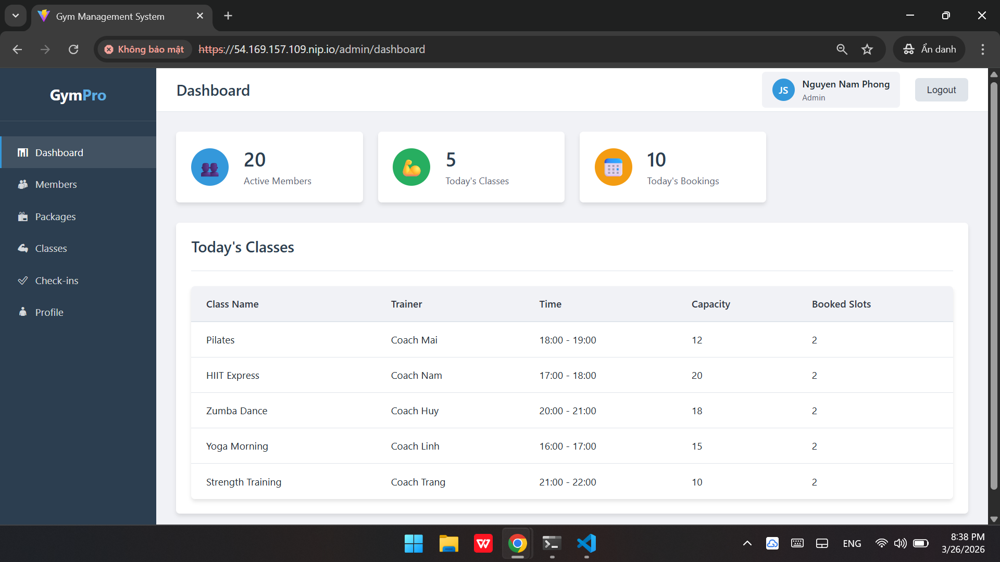

### Members Page
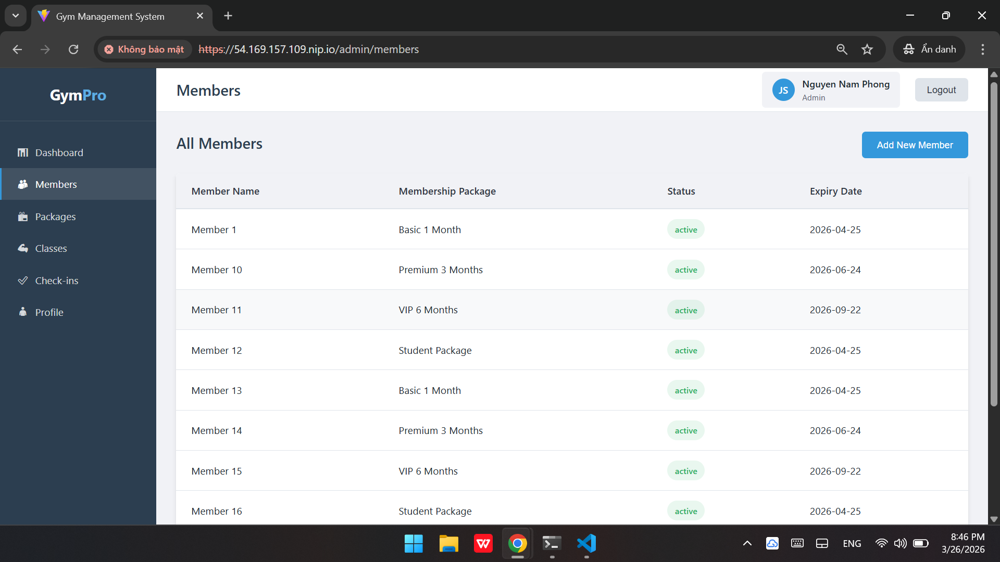

### Packages
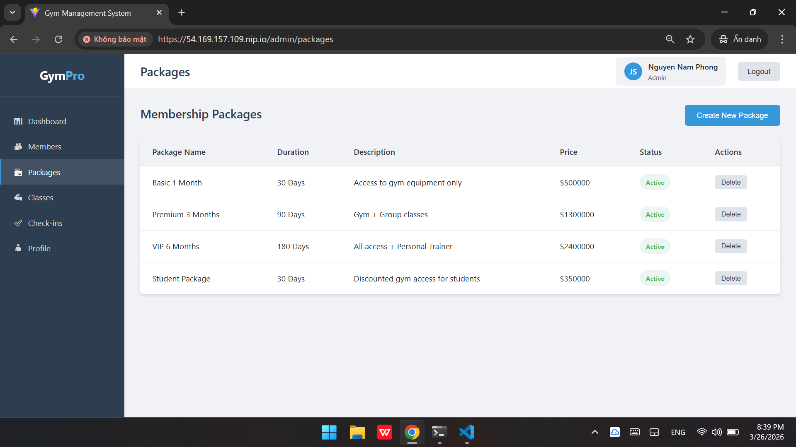

### Classes
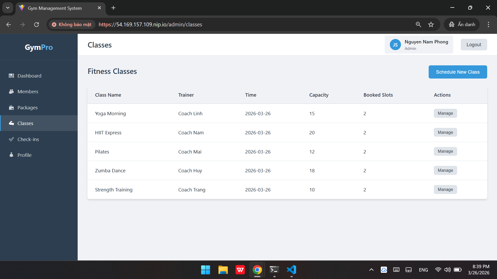

### Checkins
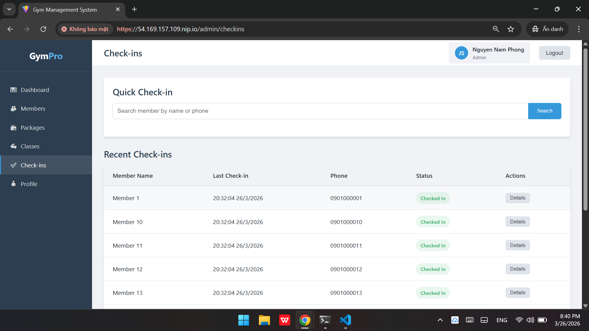

## Main Gym Page
### Home Page
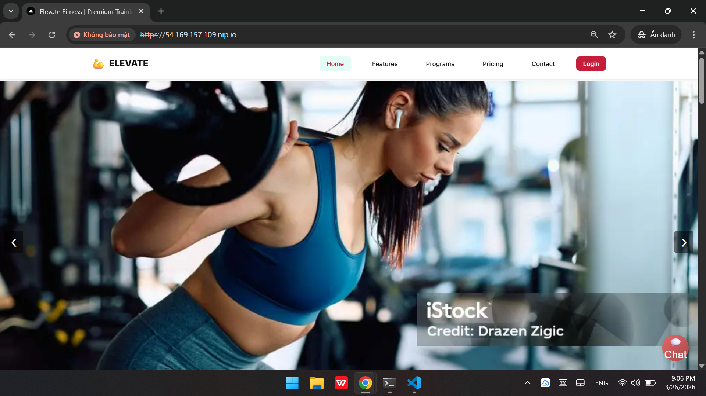

### Auth Page
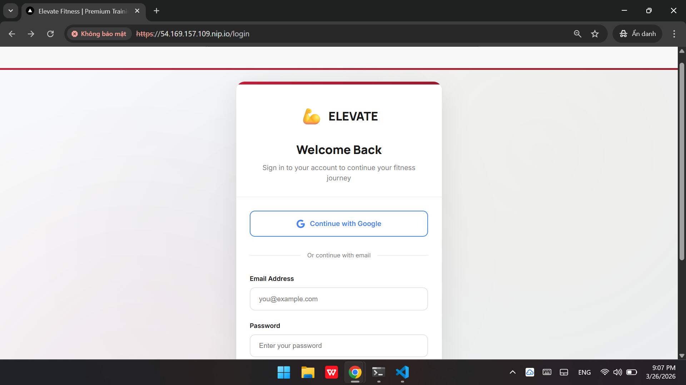

### Member Portal
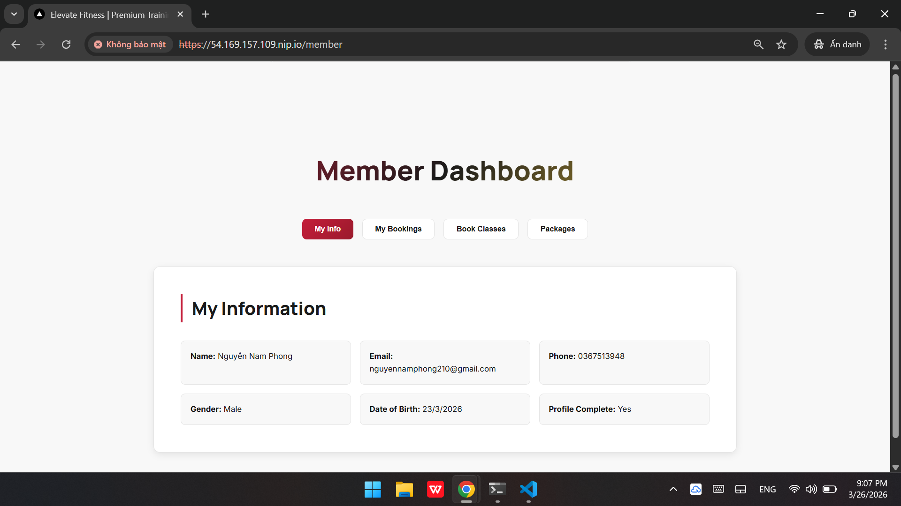
### Class Booking
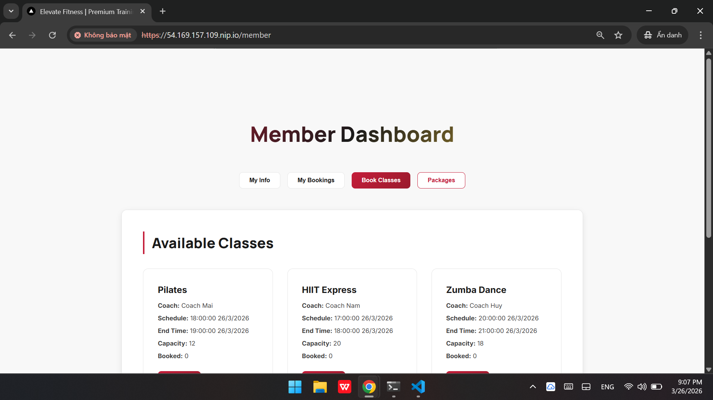

### Available Packages
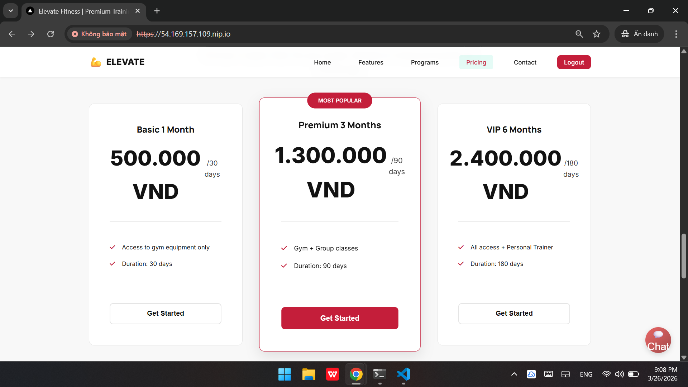

### Payment
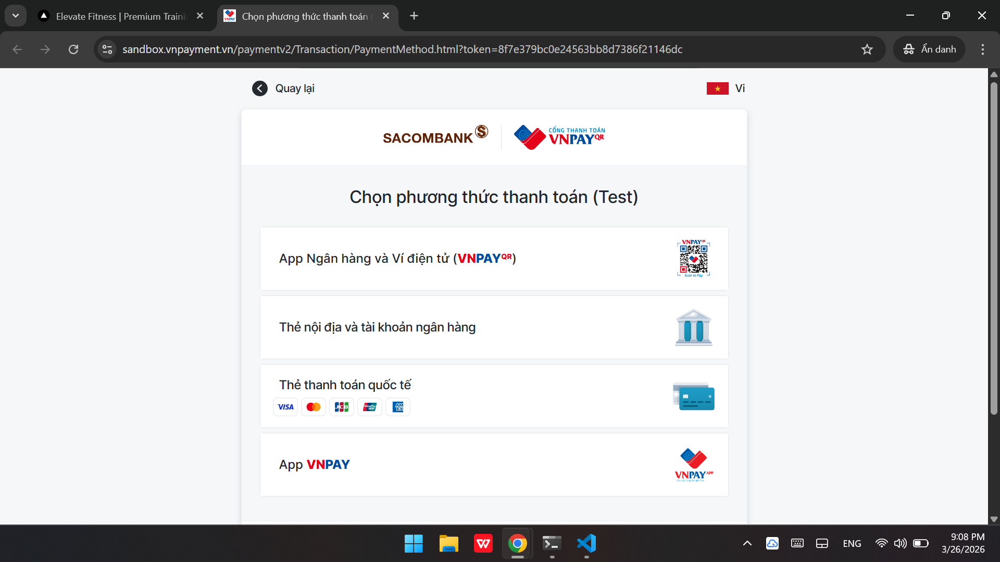

### AI Chatbot
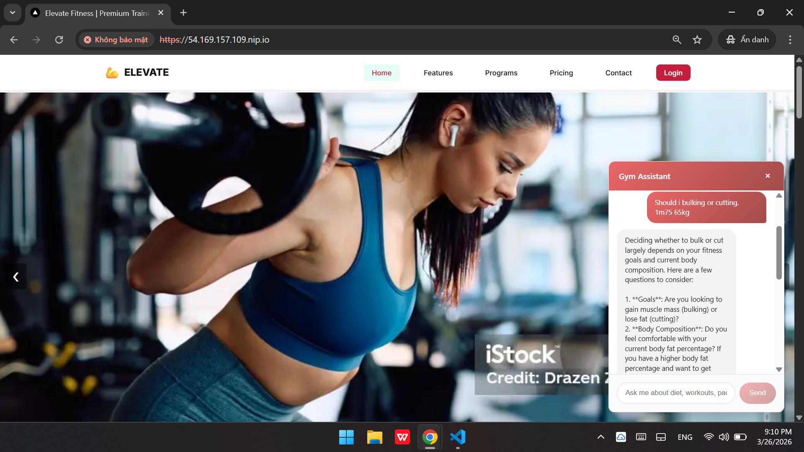


## Features

- Member management and subscriptions
- Class scheduling and booking
- Check-in tracking
- Payment integration (VNPay)
- Admin dashboard
- User portal

### Detailed Features

#### User Management

- User registration and authentication (JWT-based)
- Role-based access control (Admin, Staff, Member)
- Profile management and password reset
- Check-in functionality for gym visits

#### Member Portal

- Class browsing and booking system
- Subscription management and renewal
- Payment processing through VNPay

#### Admin Dashboard

- Staff account created by admin
- Member oversight and analytics
- Class scheduling and management
- Package and subscription configuration
- Booking management and conflict resolution
- Check-in monitoring and reporting

#### Class Management

- Create and schedule gym classes
- Capacity management and booking limits
- Class categories and instructor assignment

#### Payment & Subscriptions

- Multiple subscription packages
- VNPay integration for secure payments

#### AI Integration

- AI-powered chatbot for recommendations and insights

#### System Features

- Rate limiting for API security
- Comprehensive logging and error handling
- Docker containerization for easy deployment
- Database migrations with Prisma
